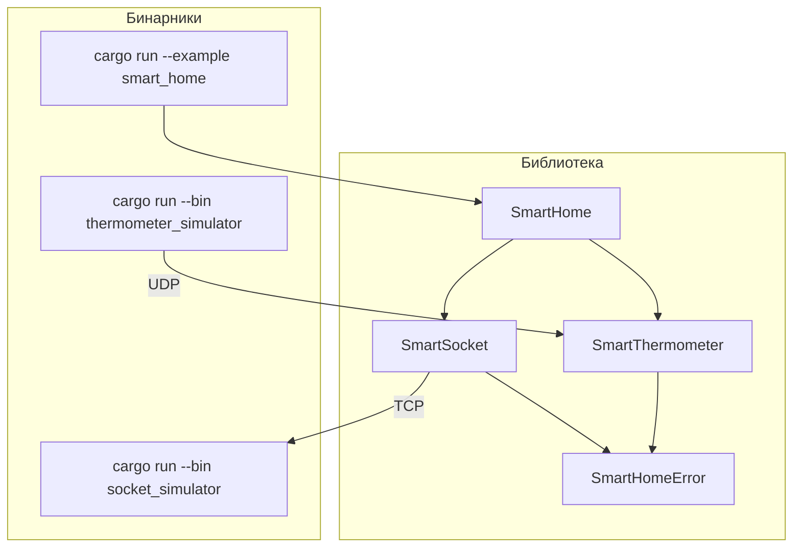

# Документ дизайна: Smart Home TCP/UDP

## Обзор

Проект реализует систему «Умный дом» на Rust с асинхронным рантаймом Tokio. Два типа устройств —
умная розетка (TCP) и умный термометр (UDP) — взаимодействуют с симуляторами через сеть. Общий
трейт `SmartDevice` обеспечивает единый интерфейс для агрегатора `SmartHome`. Архитектура
намеренно разделяет транспортный уровень, бизнес-логику устройств и агрегацию, что позволяет
подменять реальные устройства тестовыми заглушками через обобщённые параметры.

## Архитектура



### Структура пакета

```
homework_2/
├── Cargo.toml
├── src/
│   ├── lib.rs                  # re-exports всех публичных типов
│   ├── error.rs                # SmartHomeError
│   ├── home.rs                 # SmartHome, Room
│   ├── socket/
│   │   ├── mod.rs              # SmartSocket (TCP-клиент)
│   │   └── protocol.rs         # TcpCommand, TcpResponse (кодирование/декодирование)
│   └── thermometer/
│       ├── mod.rs              # SmartThermometer (UDP-слушатель)
│       └── packet.rs           # UdpTemperaturePacket (кодирование/декодирование)
├── src/bin/
│   ├── socket_simulator.rs     # SocketSimulator (TCP-сервер)
│   └── thermometer_simulator.rs# ThermometerSimulator (UDP-отправитель)
└── examples/
    └── smart_home.rs           # Пример приложения
```

## Компоненты и интерфейсы

### Трейт `SmartDevice`

```rust
/// Общий трейт для всех умных устройств.
/// Реализуется как реальными устройствами, так и тестовыми заглушками.
#[async_trait::async_trait]
pub trait SmartDevice: Send + Sync {
    /// Returns a human-readable status report for this device.
    /// On error, the report contains an error description instead of panicking.
    async fn report(&self) -> DeviceReport;
}
```

Макрос `async_trait` (крейт `async-trait`) используется для поддержки `async fn` в трейтах до
стабилизации RPITIT в объектно-безопасном контексте. Это позволяет хранить `Box<dyn SmartDevice>`
в коллекциях `SmartHome`.

---

### `SmartSocket` (модуль `socket`)

Клиент умной розетки. Хранит адрес TCP-сервера. Каждый вызов метода открывает новое TCP-соединение
(простая модель без пула соединений, достаточная для учебного проекта).

```rust
pub struct SmartSocket {
    addr: SocketAddr,
    timeout: Duration,
}

impl SmartSocket {
    pub fn new(addr: impl ToSocketAddrs, timeout: Duration) -> Result<Self, SmartHomeError>;
    pub async fn turn_on(&self)  -> Result<(), SmartHomeError>;
    pub async fn turn_off(&self) -> Result<(), SmartHomeError>;
    pub async fn power_consumption(&self) -> Result<f32, SmartHomeError>;
}
```

#### Протокол TCP (`socket/protocol.rs`)

Простой текстовый протокол: каждое сообщение — строка, завершённая символом `\n`.

| Команда (клиент → сервер) | Ответ (сервер → клиент)       |
|---------------------------|-------------------------------|
| `TURN_ON\n`               | `OK\n`                        |
| `TURN_OFF\n`              | `OK\n`                        |
| `POWER\n`                 | `POWER <f32>\n`               |
| любая другая              | `ERROR <описание>\n`          |

```rust
pub enum TcpCommand { TurnOn, TurnOff, PowerQuery }
pub enum TcpResponse { Ok, Power(f32), Error(String) }

impl TcpCommand {
    pub fn encode(&self) -> String;
    pub fn decode(s: &str) -> Result<Self, SmartHomeError>;
}
impl TcpResponse {
    pub fn encode(&self) -> String;
    pub fn decode(s: &str) -> Result<Self, SmartHomeError>;
}
```

---

### `SmartThermometer` (модуль `thermometer`)

Клиент умного термометра. При создании запускает фоновую задачу Tokio, которая слушает UDP-сокет.
Последнее полученное значение хранится в `Arc<Mutex<Option<f32>>>`. При дропе объекта фоновая
задача отменяется через `CancellationToken` (крейт `tokio-util`).

```rust
pub struct SmartThermometer {
    last_temp: Arc<Mutex<Option<f32>>>,
    cancel:    CancellationToken,
    _task:     JoinHandle<()>,
}

impl SmartThermometer {
    pub async fn new(bind_addr: impl ToSocketAddrs) -> Result<Self, SmartHomeError>;
    pub async fn temperature(&self) -> Result<f32, SmartHomeError>;
}

impl Drop for SmartThermometer {
    fn drop(&mut self) { self.cancel.cancel(); }
}
```

#### Протокол UDP (`thermometer/packet.rs`)

UDP-пакет — 4 байта в формате big-endian IEEE 754 (f32).

```rust
pub struct UdpTemperaturePacket(pub f32);

impl UdpTemperaturePacket {
    pub fn encode(&self) -> [u8; 4];
    pub fn decode(bytes: &[u8]) -> Result<Self, SmartHomeError>;
}
```

---

### `SocketSimulator` (бинарник `socket_simulator`)

TCP-сервер на Tokio. Принимает адрес из аргументов командной строки. Состояние розетки хранится в
`Arc<Mutex<SocketState>>` и разделяется между задачами-обработчиками клиентов.

```rust
struct SocketState {
    is_on:       bool,
    power_watts: f32,   // simulated value, e.g. 220.0 when on, 0.0 when off
}
```

Основной цикл: `TcpListener::bind` → `loop { listener.accept().await → tokio::spawn(handle_client) }`.

---

### `ThermometerSimulator` (бинарник `thermometer_simulator`)

UDP-клиент на Tokio. Читает конфигурацию из файла `thermometer_sim.toml`:

```toml
udp_target  = "127.0.0.1:8888"
interval_ms = 1000
```

Основной цикл: `UdpSocket::bind("0.0.0.0:0")` → `loop { send packet → sleep(interval) }`.

---

### `SmartHome` (модуль `home`)

```rust
pub struct SmartHome {
    name:  String,
    rooms: HashMap<String, Room>,
}

pub struct Room {
    name:    String,
    devices: HashMap<String, Box<dyn SmartDevice>>,
}

impl SmartHome {
    pub fn new(name: impl Into<String>) -> Self;
    pub fn add_device(&mut self, room: impl Into<String>, name: impl Into<String>, device: Box<dyn SmartDevice>);
    pub async fn house_report(&self) -> HouseReport;
}
```

`house_report()` запускает `report()` для каждого устройства конкурентно через `futures::future::join_all`.

---

### `SmartHomeError` (модуль `error`)

```rust
#[derive(Debug, thiserror::Error)]
pub enum SmartHomeError {
    #[error("I/O error: {0}")]
    Io(#[from] std::io::Error),
    #[error("Protocol error: {0}")]
    Protocol(String),
    #[error("No data available yet")]
    NoData,
    #[error("Connection timeout")]
    Timeout,
    #[error("Config error: {0}")]
    Config(String),
}
```

---

## Модели данных

```
DeviceReport  = String
HouseReport   = String (многострочный, форматированный)
```

Простые строковые псевдонимы достаточны для учебного проекта и не усложняют API.

### Зависимости (`Cargo.toml`)

| Крейт           | Версия  | Назначение                                      |
|-----------------|---------|-------------------------------------------------|
| `tokio`         | 1       | async runtime (features: full)                  |
| `async-trait`   | 0.1     | async fn in trait objects                       |
| `tokio-util`    | 0.7     | CancellationToken                               |
| `futures`       | 0.3     | join_all для конкурентных запросов              |
| `thiserror`     | 1       | derive-макросы для SmartHomeError               |
| `serde`         | 1       | десериализация конфига симулятора (features: derive) |
| `toml`          | 0.8     | парсинг TOML-конфига симулятора                 |
| `rand`          | 0.8     | генерация случайных температур в симуляторе     |
| `clap`          | 4       | CLI-аргументы для socket_simulator (features: derive) |


## Свойства корректности

*Свойство — это характеристика или поведение, которое должно выполняться при всех допустимых
исполнениях системы. Свойства служат мостом между читаемыми человеком спецификациями и
машинно-верифицируемыми гарантиями корректности.*

---

### Property 1: `report()` всегда возвращает непустую строку

*Для любого* устройства, реализующего `SmartDevice` (как рабочего, так и возвращающего ошибку),
вызов `report()` должен возвращать непустую строку `DeviceReport`.

**Validates: Requirements 1.1, 1.3**

---

### Property 2: Круговой обход TCP-команд (turn_on / turn_off)

*Для любого* состояния симулятора розетки: после отправки `TURN_ON` состояние симулятора должно
стать `is_on = true`; после последующей отправки `TURN_OFF` — `is_on = false`. Состояние
возвращается к исходному при повторном цикле.

**Validates: Requirements 2.2, 2.3, 3.3, 3.4, 3.5**

---

### Property 3: Круговой обход запроса мощности

*Для любого* значения мощности, установленного в симуляторе розетки, вызов `power_consumption()`
на клиенте должен вернуть то же значение (с точностью до f32).

**Validates: Requirements 2.4, 3.6**

---

### Property 4: Круговой обход температуры (UDP)

*Для любого* значения температуры f32, отправленного в виде `UdpTemperaturePacket` на адрес
термометра, последующий вызов `temperature()` должен вернуть то же значение.

**Validates: Requirements 4.1, 4.2, 4.3**

---

### Property 5: Диапазон температур симулятора

*Для любого* значения температуры, сгенерированного `ThermometerSimulator`, оно должно
находиться в диапазоне [−50.0, +150.0] °C.

**Validates: Requirements 5.3**

---

### Property 6: Круговой обход хранения устройств

*Для любого* набора устройств, добавленных в `SmartHome`, вызов `house_report()` должен содержать
запись для каждого добавленного устройства.

**Validates: Requirements 6.1, 6.2, 6.4**

---

### Property 7: Устойчивость к ошибкам устройств

*Для любого* набора устройств, часть из которых возвращает ошибку в `report()`, вызов
`house_report()` должен завершиться успешно и содержать записи для всех устройств (включая
описания ошибок).

**Validates: Requirements 6.3, 7.3**

---

### Property 8: Круговой обход кодирования UDP-пакета

*Для любого* значения f32 (в диапазоне допустимых f32), кодирование в `UdpTemperaturePacket` и
последующее декодирование должно вернуть исходное значение.

**Validates: Requirements 4.2** (корректность протокола UDP)

---

### Property 9: Круговой обход кодирования TCP-протокола

*Для любого* значения `TcpCommand` или `TcpResponse`, кодирование в строку и последующее
декодирование должно вернуть исходное значение.

**Validates: Requirements 2.2, 2.3, 2.4** (корректность протокола TCP)

---

## Обработка ошибок

| Ситуация                                      | Поведение                                                      |
|-----------------------------------------------|----------------------------------------------------------------|
| TCP-соединение не установлено                 | `SmartHomeError::Io` или `SmartHomeError::Timeout`             |
| Неизвестная команда на сервере                | Ответ `ERROR ...`, состояние не меняется                       |
| Некорректный ответ от сервера                 | `SmartHomeError::Protocol`                                     |
| UDP-пакет не получен (термометр только создан)| `SmartHomeError::NoData`                                       |
| Некорректный UDP-пакет (< 4 байт)             | `SmartHomeError::Protocol`, пакет игнорируется                 |
| Отсутствует или повреждён конфиг симулятора   | `SmartHomeError::Config`, процесс завершается с кодом 1        |
| Ошибка устройства при формировании отчёта     | Ошибка включается в `HouseReport` как строка, отчёт продолжается|

---

## Стратегия тестирования

### Двойной подход: unit-тесты + property-based тесты

**Unit-тесты** проверяют конкретные примеры, граничные случаи и условия ошибок:
- Декодирование некорректного UDP-пакета (< 4 байт) → `SmartHomeError::Protocol`
- `SmartThermometer::temperature()` до получения первого пакета → `SmartHomeError::NoData`
- `SmartHome::add_device` в несуществующую комнату создаёт комнату автоматически
- Неизвестная TCP-команда → ответ `ERROR ...`

**Property-based тесты** проверяют универсальные свойства на множестве сгенерированных входных данных.
Используется крейт `proptest`. Каждый тест запускается минимум 100 итераций.

Формат тега для каждого property-теста:
`// Feature: smart-home-tcp-udp, Property N: <краткое описание>`

### Соответствие свойств тестам

| Свойство | Тип теста       | Модуль                          |
|----------|-----------------|---------------------------------|
| P1       | property        | `tests::device_trait`           |
| P2       | property        | `tests::socket_protocol`        |
| P3       | property        | `tests::socket_protocol`        |
| P4       | property        | `tests::thermometer`            |
| P5       | property        | `tests::thermometer_simulator`  |
| P6       | property        | `tests::home`                   |
| P7       | property        | `tests::home`                   |
| P8       | property        | `tests::thermometer_packet`     |
| P9       | property        | `tests::socket_protocol`        |

### In-process тестирование

Для тестирования без реальной сети используются:
- **`MockSmartDevice`** — заглушка `SmartDevice`, возвращающая заданный `DeviceReport` или ошибку.
- **In-process TCP-сервер** — `TcpListener` на `127.0.0.1:0` (порт 0 = ОС выбирает свободный),
  запускается в `tokio::spawn` внутри теста.
- **In-process UDP** — `UdpSocket::bind("127.0.0.1:0")` для отправки пакетов термометру в тесте.

Это позволяет тестировать полный стек без внешних процессов.
